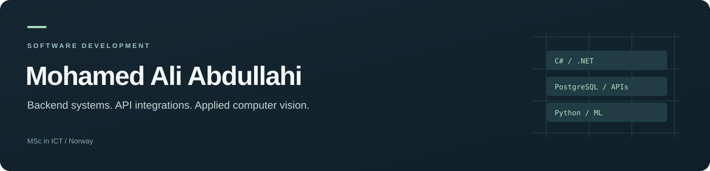

I'm **Mohamed Ali Abdullahi**, a full-stack software developer based in **Norway**, with an **MSc in ICT**. I develop backend APIs, web interfaces and mobile applications, and explore how machine learning and computer vision can solve practical problems.

My main stack is **C#/.NET, PostgreSQL, JavaScript/TypeScript, React and React Native**. For data and computer vision work, I use **Python** and tools such as **scikit-learn, PyTorch and YOLO**.

I enjoy connecting the pieces of an application: the data model, API contracts, user interface and external services. My strongest interests are **backend development, API integrations and applied computer vision**.

**[Contact me](mailto:thoravgs4@gmail.com)** · [About my work](#about-my-work) · [Featured projects](#featured-projects) · [Technical skills](#technical-skills)

## About my work

My engineering background combines software development with AI and machine learning. I like working on problems where understanding the data is as important as writing the code—whether that means defining relationships in a database, following a transfer through a mobile app, or interpreting anatomical landmarks in an image.

My development interests include modular backend architecture, payment API integrations, webhook handling and idempotency: making repeated requests safe to process. I am also interested in how clear boundaries between components make an application easier to extend and maintain.

This portfolio brings together **research, integration prototypes and learning projects**. The repositories include setup instructions, examples and walkthroughs so you can follow the implementation and understand its current scope.

## Featured projects

### Salmon keypoint detection & geometric analysis

**Python · YOLO pose estimation · Computer vision**

This research project examines **20 anatomical landmarks** on salmon images. It connects pose estimation with geometric analysis, turning landmark coordinates into distances, slopes and shape ratios. It includes dataset validation, training and inference helpers, and a walkthrough of the research workflow.

[Explore the project](https://github.com/MohammedAli201/YOLO-keypoint-detection-Salmon-fish) · [Research walkthrough](https://github.com/MohammedAli201/YOLO-keypoint-detection-Salmon-fish/blob/main/docs/research-walkthrough.md)

Example dataset annotations. The walkthrough explains the evaluation still needed to assess a trained model.

### Flow — Income & Expense Tracker

**React · JavaScript · Context API · Interaction testing**

A responsive interface for tracking income and expenses in NOK. Users can add, filter, edit and delete transactions, then see how those changes affect the summaries. The repository includes desktop and mobile screenshots, a guided code walkthrough and **six interaction tests** covering the main workflows. Data is held for the current browser session.

[Explore the project](https://github.com/MohammedAli201/income-expense-tracker)

### Teams API

**C# · ASP.NET Core · PostgreSQL · Entity Framework Core**

A backend learning project that models teams, drivers and media records. It demonstrates controller endpoints, database relationships, migrations and a unit-of-work pattern. The API walkthrough and sample HTTP requests make it easier to trace a request from the controller to the database. This repository uses the historical .NET 6 stack.

[Explore the project](https://github.com/MohammedAli201/.NET-6-PostgreSQL-and-EF-Core) · [API walkthrough](https://github.com/MohammedAli201/.NET-6-PostgreSQL-and-EF-Core/blob/main/docs/api-walkthrough.md)

### Iris Classifier

**Python · Flask · scikit-learn · Model serving**

A small machine learning application that predicts an Iris flower class from four measurements. A saved scikit-learn Pipeline connects the model to a validated web form. The repository includes a running application screenshot, an explanation of the training and serving flow, and regression tests for valid and invalid inputs.

[Explore the project](https://github.com/MohammedAli201/ML-Model-Flask) · [Model walkthrough](https://github.com/MohammedAli201/ML-Model-Flask/blob/main/docs/model-walkthrough.md)

### Remittance mobile client

**React Native · TypeScript · Expo · API integrations**

A mobile client prototype exploring a remittance workflow. The implementation includes API services, typed contracts, shared transfer state across screens and reusable interface components. Its engineering walkthrough explains how these pieces fit together and identifies the integration work still required.

[Explore the project](https://github.com/MohammedAli201/mobileRemittence)

### Identity with MongoDB

**C# · ASP.NET Core Identity · MongoDB · JWT**

A historical backend sample exploring identity configuration, JWT authentication and student/course repositories. It provides another example of organising API endpoints and data access with a different database technology.

[Explore the project](https://github.com/MohammedAli201/MongoDbExample)

## Technical skills

| Area | Technologies and focus |
| --- | --- |
| Backend & data | C#, ASP.NET Core, EF Core, PostgreSQL, MongoDB, REST APIs, identity and JWT |
| Web & mobile | JavaScript, TypeScript, React, React Native, Expo, responsive interfaces |
| AI & computer vision | Python, scikit-learn, PyTorch, YOLO, keypoint detection, geometric analysis |
| Development practice | Git/GitHub, automated checks, input validation, code walkthroughs and documentation |

## Working with me

I work both independently and with others, and ask questions when requirements need clarification. I enjoy learning unfamiliar tools, breaking problems into manageable steps and explaining the reasoning behind an implementation.

I'm interested in **software development opportunities and collaborations** involving backend systems, API integrations, web/mobile applications or applied computer vision.

**Let's connect:** [thoravgs4@gmail.com](mailto:thoravgs4@gmail.com)
